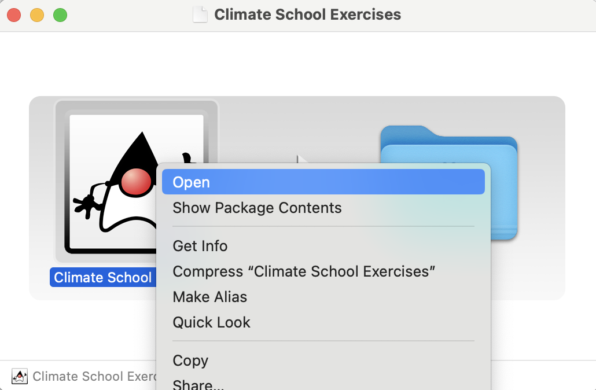

# Climate School Exercises

** Note: The material in this repository will be updated during the next days. Please check back.**

------

## About this Repository

This repository contains some elementary experiments related to the DICE model, stochastic interest rates models and combinations thereof.

The experiments are associated with a session at the *Munich Climate School* on *Climate Models and Interest Rate Risk*. **Note:** The repository may get some updates/improvements after the climate school.

The session will first discuss the theory and intuition behind integrated assessment models (IAMs)—the coupling of a physical climate model with an economic model. We will then combine the IAM with (stochastic) interest-rate models to analyze the effect of discounting.

To make these ideas tangible, we use a full open-source implementation of the DICE model together with several interest-rate models and Monte Carlo simulation. This enables hands-on numerical experiments and, if you like, code exploration.

There are three ways to participate:

- **Lecture mode**: you simply follow the presentation — nothing required on your side.

- **Gaming mode**: you download the executable program and run the graphical user interface to play with scenarios and parameters.

- **Developer mode**: import the code into an IDE to inspect, run, and extend the implementation.

Note: Programming experience is not required for lecture or gaming mode. The hands-on part is optional.
If you’d like to run the code during the session, see optional setup below.

## Presentation

*Updated presentation slides will be available though this page soon*

------

## Numerical Experiments through Graphical User Interface

We provide a binary version of the experiments for

- Windows (file ending .msi)
- MacOS (file ending .dmg)
- Linux (file ending .deb)

at [github.com/finmath/climate-school-exercises](https://github.com/finmath/climate-school-exercises/releases/latest).

### Installation and Running on Windows

- Download the .msi installer from [github.com/finmath/climate-school-exercises](https://github.com/finmath/climate-school-exercises/releases/latest).
- Run the installer (double click on the downloaded .msi file).
- You will be asked twice to confirm the installation, because the file is not signed.
- You now find the programm in `C:\Program Files\Climate School Exercises`. Open this folder an double click `Climate School Exercises.exe`.

### Installation and Running on MacOS

- Download the .dmg file from [github.com/finmath/climate-school-exercises](https://github.com/finmath/climate-school-exercises/releases/latest)
- Open the downloaded .dmg file (double click on the downloaded .dmg file).
- Optional: Move the  `Climate School Exercises` program to the application folder and open the application folder.
- Right-Click on the `Climate School Exercises` program an select open (double-click to open does not work here, because the file is not signed)
- You will be asked to confirm to open the file, because the file is not signed

------

## Numerical Experiments - Running and Modifying Code

There are currently seven different numerical experiments in the Java package `net.finmath.climateschool.experiments`.

Feel free play with them. Alter parameters and check results.

Note: We use models from *finmath lib*. This code is open source and available at https://github.com/finmath/finmath-lib

### Importing in Eclipse from GitHub

Import this git repository into Eclipse and start working.

- Got to this repository on GitHub
- Click on “Clone or download” and copy the URL to your clipboard.
- Go to Eclipse and select File → Import → Git → Projects from Git **(with smart import)**.
- Select “Clone URI” and paste the GitHub URL from step 2.
- Select "main", then Next → Next → Finish.

Note: If you choose "Projects from Git" without the option "(with smart import)" you may expirience that
the project is not imported into Eclipse, but it was successfully checked out via git, i.e. you
find the project files in you local git folder. In that case, you can import the project "as maven project"
(see below).

### Importing in Eclipse (as Maven Project) (Alternatively)

If you checked out the git repository manually (`git clone`), then import
the local git folder as Maven Project;

- File → Import → Maven → Existing Maven Projects
- Select the project folder in you *local* git folder.

## Testing your Setup

To test your setup, run the Java Class `Test.java` in the package `net.finmath.climateschool.begin`. To do so: In the Eclipse Project Explorer:

- Expand `src/main/java'
- Expand `net.finmath.climateschool.begin`
- Right-click on the class `Test.java`,
- then select “Run As → Java Application".
  
## Update the Project (later)

To get an update of this project at a later time

- Right click on the project,
- then select “Team → Pull".
 
 This will *pull* updates committed to the project.
 
Note: If you modified files in the project, you may see "merge conflicts". At the current stage it is recommended that you do not modify existing files. You may add new ones.