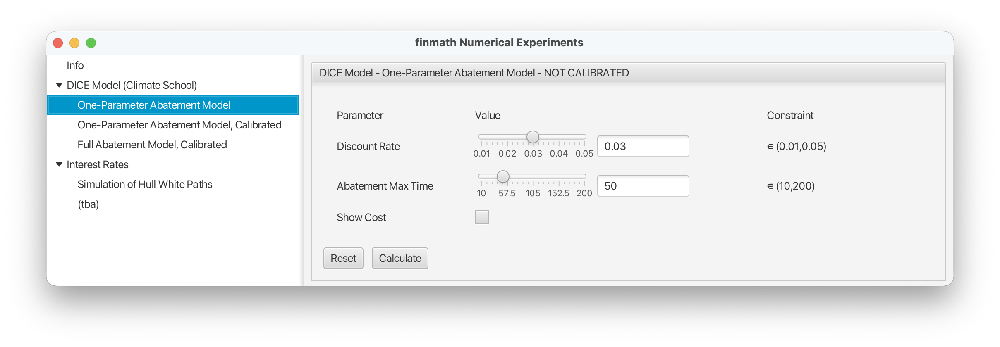
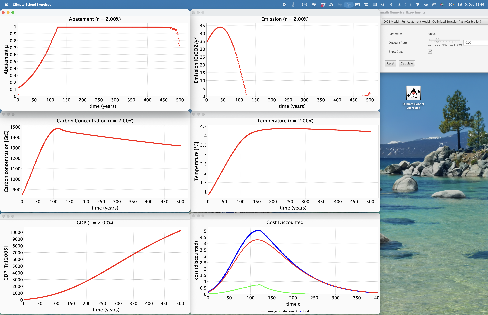

# Climate School Exercises

**Note: The material in this repository will be updated over the next few days. Please check back.**

------

## About this Repository

This repository contains some elementary experiments related to the DICE model, stochastic interest-rate models, and combinations thereof.

The experiments are associated with a session at the *Munich Climate School* on *Climate Models and Interest Rate Risk*. **Note:** The repository may receive updates and improvements after the climate school.

The session will first discuss the theory and intuition behind integrated assessment models (IAMs)—the coupling of a physical climate model with an economic model. We will then combine the IAM with (stochastic) interest-rate models to analyze the effect of discounting.

To make these ideas tangible, we use a full open-source implementation of the DICE model together with several interest-rate models and Monte Carlo simulation. This enables hands-on numerical experiments and, if you like, code exploration.

There are three ways to participate:

- **Lecture mode**: you simply follow the presentation — nothing required on your side.

- **Gaming mode**: you download the executable program and run the graphical user interface to play with scenarios and parameters.

- **Developer mode**: import the code into an IDE to inspect, run, and extend the implementation.

Note: Programming experience is not required for lecture or gaming mode. The hands-on part is optional.
If you’d like to run the code during the session, see optional setup below.

## Presentation

Download the [presentation slides (PDF)](https://github.com/finmath/climate-school-exercises/raw/refs/heads/main/presentation/Presentation%202026%20Climate%20School%20-%20DICE%20-%20Intergenerational%20Equity%20DICE%20Nonlinear%20Discounting%20-%20Fries.pdf).

------

## Numerical Experiments via a Graphical User Interface

We provide a binary version of the experiments for

- Windows (file ending `.msi`)
- macOS (file ending `.dmg`)
- Linux (file ending `.deb`)

on the [Climate School Exercises Releases Page](https://github.com/finmath/climate-school-exercises/releases/latest).

  

<em>Choose an experiment and configure its parameters.</em>

  

<em>Example output from the full-abatement experiment.</em>

### Installation and Running on Windows

- Download the `.msi` installer from [github.com/finmath/climate-school-exercises](https://github.com/finmath/climate-school-exercises/releases/latest).
- Run the installer (double-click the downloaded `.msi` file).
- You will be asked twice to confirm the installation, because the file is not signed.
- You can now find the program in `C:\Program Files\Climate School Exercises`. Open this folder and double-click `Climate School Exercises.exe`.

### Installation and Running on macOS

- Download the `.dmg` file from [github.com/finmath/climate-school-exercises](https://github.com/finmath/climate-school-exercises/releases/latest).
- Open the downloaded `.dmg` file (double-click the file).
- Move `Climate School Exercises` to the Applications folder and open it.
- Confirm the standard first-launch prompt for an application downloaded from the Internet.

### Signing macOS Releases (Maintainers)

Tagged releases use Developer ID signing and Apple notarization. The one-time Apple and GitHub setup is documented in [doc/macos-code-signing.md](doc/macos-code-signing.md).

------

**The following is for those with basic experience in programming.**

------

## Numerical Experiments - Running and Modifying Code

You can also run the raw code of the experiments.

There are currently seven different numerical experiments in the Java package `net.finmath.climateschool.experiments`.

Feel free to play with them. Alter parameters and check the results.

Note: We use models from *finmath-lib*. This code is open source and available at [github.com/finmath/finmath-lib](https://github.com/finmath/finmath-lib).

### Importing into Eclipse from GitHub

Import this Git repository into Eclipse and start working.

- Go to this repository on GitHub.
- Click on “Clone or download” and copy the URL to your clipboard.
- Go to Eclipse and select File → Import → Git → Projects from Git **(with smart import)**.
- Select “Clone URI” and paste the GitHub URL from step 2.
- Select "main", then Next → Next → Finish.

Note: If you choose “Projects from Git” without the option “(with smart import),” the project may be checked out via Git without being imported into Eclipse. In that case, you can find the project files in your local Git folder and import the project as a Maven project (see below).

### Alternatively: Importing into Eclipse as a Maven Project

If you checked out the Git repository manually (`git clone`), import the local Git folder as a Maven project:

- File → Import → Maven → Existing Maven Projects
- Select the project folder in your *local* Git folder.

## Testing Your Setup

To test your setup, run the Java class `Test.java` in the package `net.finmath.climateschool.begin`. To do so, in the Eclipse Project Explorer:

- Expand `src/main/java`.
- Expand `net.finmath.climateschool.begin`.
- Right-click the class `Test.java`.
- Select “Run As → Java Application.”

### Update the Project (later)

To update this project at a later time:

- Right-click the project.
- Select “Team → Pull.”

This will *pull* updates committed to the project.

Note: If you modified files in the project, you may see "merge conflicts". At the current stage it is recommended that you do not modify existing files. You may add new ones.
